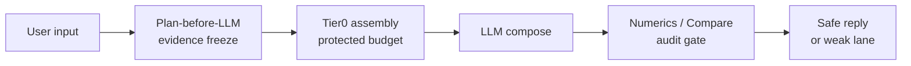

# Personal Health Agent (PHA)

**Local-first personal health intelligence** — import Apple Health exports, parse lab reports and wearable screenshots, and chat with an evidence-grounded AI. All data stays on your machine.

> **Not a medical device.** PHA does **not** provide medical advice, diagnosis, or treatment. Outputs are for personal wellness tracking only. Always consult qualified healthcare professionals.


| | |
|---|---|
| **License** | [Apache-2.0](LICENSE) |
| **Python** | 3.10+ |
| **LLM** | [Ollama](https://ollama.com) (local) |
| **Release** | [`v0.4.0-beta.1`](https://github.com/hihewh-byte/personal_health_agent/releases/tag/v0.4.0-beta.1) |
| **Build** | `pha-v2.3.32-full-import-only` |

---

## Why PHA?

Most “health chatbots” let the LLM invent numbers. PHA flips the control plane:

1. **Harness plans first** — each turn freezes which evidence slots are allowed (`TurnEvidencePlan`)
2. **Tier0 budget** — critical facts are protected; the model cannot crowd them out
3. **Numerics / Compare audit** — user-visible numbers must match injected evidence or the reply is downgraded

If you are learning to **build agents that stay honest under weak local LLMs**, the harness layer is the interesting part — not the chat UI.

> ⚠️ **Beta (`v0.4.0-beta.1`)** — Core anti-hallucination paths are covered by offline selfchecks. Adaptive reply language (RLP) and large English asset corpora are **not** fully stress-tested. If something breaks, [open an Issue](https://github.com/hihewh-byte/personal_health_agent/issues) — edge cases fuel Phase 2.

---

## 30-second No-LLM Golden Run (see the harness first)

No Ollama, no API keys. After `pip install -r requirements.txt`:

```bash
PYTHONPATH=. python scripts/pha_harness_golden_run.py
```

You should see two dry-run turns (`supplement_manifest`, `combined_review`) with **profile**, **Tier0 slots**, **tools_allowed**, and `RESULT: PASS`. That is the control plane: Plan → Tier0 assembly → BuildReport — before any model call.

Builder notes: [docs/harness-builder-overview.md](docs/harness-builder-overview.md)

---

## 5-minute Quick Start (native · recommended first try)

**Honest timing**

| Machine state | Time to open UI |
|---------------|-----------------|
| Ollama + `qwen2.5:7b-instruct` already installed | **~3–5 min** |
| Cold start (first model pull ~4–5 GB) | **15–40 min** (network-bound) |

### Prerequisites

- macOS or Linux, Python 3.10+
- [Ollama](https://ollama.com) running (`ollama serve` or Ollama Desktop)
- Optional later: Tesseract (OCR for screenshots)

### Steps

```bash
git clone https://github.com/hihewh-byte/personal_health_agent.git
cd personal_health_agent

python3 -m venv .venv && source .venv/bin/activate
pip install -r requirements.txt

cp .env.example .env
# Minimum chat model (skip the full pull-models.sh on first try)
ollama pull qwen2.5:7b-instruct

python scripts/doctor.py
PYTHONPATH=. python -m pha.main
```

Open **http://127.0.0.1:8788**

**Smoke check (another terminal):**

```bash
curl -s http://127.0.0.1:8788/health
# → {"pha_build":"pha-v2.3.32-full-import-only", ...}
```

Empty warehouse is OK — you can chat immediately; import Apple Health `export.zip` from the **Data import** drawer when ready.

**Docker path** (needs Docker Desktop + host Ollama): see [docs/INSTALL.md](docs/INSTALL.md).

---

## Features

- **Apple Health import** — `export.zip` → SQLite warehouse (steps, sleep, HRV, workouts, labs)
- **Wearable screenshot review** — Watch OCR → 90-day CompareTable + audit / hybrid fallback
- **Lab / supplement attachment QA** — vision parse, episodic focus, numerics compliance
- **Harness evidence engine** — TurnEvidencePlan, Tier0 budget, Catalog fetch, C-layer audit
- **Metric Registry** — config-driven compare rows + wearable catalog
- **Dashboard UI i18n** — default English (`PHA_UI_LANG=en`); switch to 中文 in the top bar
- **Adaptive reply language (RLP)** — replies follow UI / user language (`PHA_RESPONSE_LOCALE`)

---

## Environment variables

| Variable | Default | Description |
|----------|---------|-------------|
| `PHA_HOST` | `127.0.0.1` | Bind address (`0.0.0.0` in Docker) |
| `PHA_PORT` | `8788` | HTTP port |
| `OLLAMA_BASE_URL` | `http://127.0.0.1:11434` | Ollama API |
| `OLLAMA_MODEL` | `qwen2.5:7b-instruct` | Default chat model |
| `OLLAMA_MEDICAL_MODEL` | `qwen2.5:7b-instruct` | Vision / medical parse |
| `PHA_UI_LANG` | `en` | Dashboard UI: `en` \| `zh` |
| `PHA_RESPONSE_LOCALE` | `en` | LLM reply default when API omits `response_locale` |

Full list: [.env.example](.env.example)

---

## Architecture (short)



```text
User message → Harness TurnEvidencePlan → Tier0 evidence blocks
            → Ollama (chat / tools / catalog) → Numerics / Compare audit
            → SSE reply + SQLite persistence
```

Deep dive: [docs/pha-architecture-evolution-v2.3.md](docs/pha-architecture-evolution-v2.3.md) · Harness for builders: [docs/harness-builder-overview.md](docs/harness-builder-overview.md) · Consensus: [docs/harness-consensus-opus48-2026-06-08.md](docs/harness-consensus-opus48-2026-06-08.md)

---

## Self-checks

```bash
PYTHONPATH=. python scripts/pha_harness_golden_run.py   # no LLM
bash scripts/run_selfchecks.sh                          # full offline suite (~47 checks)
python scripts/doctor.py                                # runtime environment
```

---

## Data layout

| Path | Purpose |
|------|---------|
| `data/pha_storage.db` | SQLite warehouse (gitignored) |
| `storage/users/` | Per-user assets (gitignored) |
| `storage/attachments/` | Chat attachments (gitignored) |
| `storage/registry/` | Metric Registry JSON (shipped) |

**Never commit** `.env`, `data/`, `storage/users/`, or `*.db` files.

---

## Future Work (Enterprise · not in personal OSS v0.4)

| RFC | Scope |
|-----|--------|
| [docs/rfcs/rfc-device-ingestion-adapter.md](docs/rfcs/rfc-device-ingestion-adapter.md) | Universal MQTT/BLE/API ingest · dual-layer provenance |
| [docs/rfcs/rfc-enterprise-multi-tenant.md](docs/rfcs/rfc-enterprise-multi-tenant.md) | Enterprise Gateway · RBAC · composite `user_id` |

Checklist: [docs/wave4a-open-source-readiness-spec.md](docs/wave4a-open-source-readiness-spec.md)

---

## Contributing

See [CONTRIBUTING.md](CONTRIBUTING.md). Run `bash scripts/run_selfchecks.sh` before opening a PR.

Building agents / fighting numerical hallucination? Star the repo or [open an Issue](https://github.com/hihewh-byte/personal_health_agent/issues) with your edge case — that feedback drives Phase 2 more than vanity metrics.

Security: [SECURITY.md](SECURITY.md) · Changelog: [CHANGELOG.md](CHANGELOG.md)
