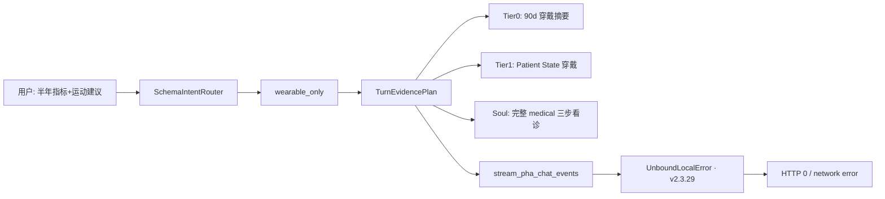

#  incident 分析报告：对话 HTTP 0 + Hero 面板空值（v2.3.29 @ :8788）

> **日期**：2026-06-07  
> **Build**：`pha-v2.3.29-wave4a-onboarding-ui-docker`  
> **端口**：8788（`.env`）  
> **约束**：本报告仅分析，不含代码变更。

---

## 1. 现象摘要

| 现象 | 用户侧表现 | 服务端证据 |
|------|------------|------------|
| 穿戴/运动类对话 | `请求失败 HTTP 0` / `TypeError: network error` | `/tmp/pha-8788.log` 出现 `UnboundLocalError: user_message_needs_wearable_query` |
| Hero 三卡 | 今日步数 / 近 7 日 HRV / 近 7 日睡眠均为 `—` | `GET /dashboard/hero-stats` 返回三字段均为 `null`，`db_samples=14026` |

复现句（用户）：

> 请根据过去半年我的身体指标，给我提出一些运动方面的建议

---

## 2. 问题 A：对话失败（P0 · 确定性代码缺陷）

### 2.1 根因

`pha/chat_service.py` → `stream_pha_chat_events()` 存在 **Python 作用域冲突**：

- 文件顶部已 `from pha.intent_gates import user_message_needs_wearable_query`（约 L42）
- 函数**后半段**再次 `from pha.intent_gates import user_message_needs_wearable_query`（约 L1868）
- Python 将同名符号视为**整个函数的局部变量**；执行到**前半段**（约 L1634）调用时，局部变量尚未赋值 → **`UnboundLocalError`**

SSE 生成器未捕获该异常 → 连接被 abrupt 关闭 → 浏览器 `fetch` 报 **HTTP 0 / network error**（并非 CORS 或端口错误）。

### 2.2 路由链路（该句为何触发）

```text
resolve_schema_intent(msg)
  → profile: wearable_only（「身体指标」「运动」+ 个人「我」）
build_turn_evidence_plan
  → Tier0: WEARABLE_90D_SUMMARY + TASK
  → Tier1: PATIENT_STATE_WEARABLE
stream_pha_chat_events
  → 进入 wearable 分支 → 命中 L1634 即崩溃（v2.3.29）
```

与「过去半年」字面窗口**无关**——Harness 仍注入约 90 日/库内可用跨度摘要；崩溃发生在 LLM 调用之前的编排阶段。

### 2.3 与回退 / 架构的关系

| 版本 | 该 bug |
|------|--------|
| **v2.3.29（当前）** | **存在** |
| v2.3.31（未合并，已回退丢弃） | **已修复**（删除 L1868 重复 import） |
| v2.3.30 health_education | **无关**（不改变 wearable 链路） |

**结论**：回退到 v2.3.29 解决了 daemon/端口实验问题，但**主动放弃了 v2.3.31 的 1 行聊天修复**，导致穿戴类对话必现崩溃。

### 2.4 建议修复（不动架构，最小 diff）

1. **Cherry-pick / 手工**：删除 `stream_pha_chat_events` 内 L1868 重复 import（保留模块级 import 即可）
2. 跑 `scripts/pha_restart_accept.sh` + 用复现句 curl `POST /api/chat` 验证 SSE 至 `event: done`
3. **不要**为修此 bug 重新引入 `pha_daemon.sh`（进程模型与聊天 bug 正交）

---

## 3. 问题 B：Hero 面板三卡为空（P1 · 数据窗口与日历不对齐）

### 3.1 根因（非前端渲染 bug）

API 实测（2026-06-07）：

```json
{
  "today_steps": null,
  "avg_hrv_7d": null,
  "avg_sleep_7d": null,
  "db_samples": 14026,
  "db_max_timestamp": "2026-05-21T12:00:00"
}
```

逻辑链：

```text
effective_query_reference_date()  → OS 今天 2026-06-07
hero_stats 查询窗口              → [2026-06-01, 2026-06-07]（近 7 日）
wearable_daily 表                 → 该窗口内 0 行
库内最新穿戴日                    → 2026-05-21（落后 17 天）
```

前端 `app.js` → `loadHeroStats()` 对 `null` 正确显示 `—`；**API 200，无 JS 报错**。

### 3.2 与下方图表的关系

- Hero 卡：**固定「日历近 7 日」**，无数据则空
- `metric-trends` 等图表：可能使用**更长历史窗口**，仍可有曲线 → 用户可能看到「图表有数、Hero 无数」的**认知冲突**（非代码冲突，是产品设计）

### 3.3 建议（无需改代码的运维手段）

| 优先级 | 手段 | 说明 |
|--------|------|------|
| **P1** | 重新导入 Apple Health `export.zip` | 使 `wearable_daily` 覆盖到真实今天 |
| **P2** | `.env` 设 `PHA_ENV_DEMO_ANCHOR=2026-05-21` | 将系统「参考日」对齐库内最后有数据日；Hero 7 日窗口回到 5/15–5/21 |
| **P3** | 确认 `user_id=default` | Hero 与导入用户一致 |

### 3.4 架构改进方向（后续版本，本次不写代码）

- Hero 在无 7 日数据时：fallback 为「以 `db_max_timestamp` 为锚的最近 7 个有数据日」并 UI 标注「数据截至 YYYY-MM-DD」
- 与 `sync-status` 卡片联动提示「穿戴数据已过期 N 天」

---

## 4. 代码冲突与版本架构对照

### 4.1 当前运行态 vs Git 历史

```text
运行: v2.3.29 + 本地补丁（.env PHA_PORT=8788, pha_restart_accept 读 .env, PHA-Serve.command）
Git HEAD: 3c4a8ed (v2.3.29)
未合并: 3c801de (v2.3.30 health_education), v2.3.31 chat fix, pha_daemon（已 clean）
```

| 能力 | v2.3.29 当前 | 回退丢弃项 | 与用户现象关系 |
|------|--------------|------------|----------------|
| 穿戴聊天 | **崩** | v2.3.31 fix | **直接因果** |
| 科普双车道 | 无 | v2.3.30 | 无关 |
| 进程守护 | 前台 Terminal | pha_daemon | 无关（页面能开） |
| 端口 | 8788 | 8787 默认 | 无关（health 200） |

### 4.2 Harness 架构（该对话在 v2.3.29 下的设计行为）



**设计注记**：

- 「半年」未进入 `parse_user_date_range` 时，实际证据窗口由 `build_wearable_90d_summary_block` / 库内跨度决定（曾测约 163 天），与 Hero「近 7 日」**不同数据源、不同窗口**——属 intentional 分层，但 UI 未向用户解释。

### 4.3 与 Wave 5 / health_education 的冲突裁定

- **health_education**（v2.3.30）：只影响无个人挂钩的科普 fallback，**不修复**本句（含「我」→ lifestyle/wearable）
- **Wave 5 TurnOrchestrator 拆分**：长期降 `stream_pha_chat_events` 复杂度，可减少同类 import 回归；**非本次 incident 必需**

---

## 5. 解决方案路线图（建议执行顺序）

### 阶段 0 — 立刻可验证（无代码）

1. 浏览器访问 `http://127.0.0.1:8788/dashboard/hero-stats?user_id=default` — 若三字段 `null` 且 `db_max_timestamp` 早于今天 → 确认 **数据过期** 结论
2. 查看 `/tmp/pha-8788.log` 对话前后是否有 `UnboundLocalError` → 确认 **聊天 bug** 结论

### 阶段 1 — 最小修复（1 行，建议优先于 v2.3.30 全量）

- 删除 `chat_service.py` L1868 重复 import（同 v2.3.31）
- 重启 PHA，复测对话

### 阶段 2 — 数据（Hero 有数）

- 导入最新 Apple Health，或临时 `PHA_ENV_DEMO_ANCHOR=2026-05-21`

### 阶段 3 — 可选能力恢复

| 需求 | 建议 |
|------|------|
| 科普不问账本 | cherry-pick `3c801de`（health_education） |
| 服务常驻 | 继续用 `PHA-Serve.command` 前台；daemon 另开 PR 实测 |
| Hero 智能 fallback | 新产品需求，单独立项 |

---

## 6. 结论

1. **对话失败**：v2.3.29 **已知回归** — `stream_pha_chat_events` 内重复 import 导致 `UnboundLocalError`；与端口 8788、回退本身无因果关系；**v2.3.31 已验证修复**。
2. **Hero 空值**：**库内穿戴数据止于 2026-05-21**，查询窗口为 **2026-06-01~06-07**，非前端故障；14026 行历史数据仍在。
3. **架构**：两问题分属 **编排层 bug（C 层前）** 与 **数据新鲜度 + 固定 7 日窗口（产品/数据层）**；不宜混为「回退失败」或「8788 端口问题」。
4. **推荐**：先 **1 行 chat fix** → 再 **补数据或 DEMO_ANCHOR** → 再按需 cherry-pick v2.3.30；**勿**在未修 chat 前全量前进 v2.3.30。

---

## 附录：关键代码位置

| 模块 | 路径 | 说明 |
|------|------|------|
| 聊天 crash | `pha/chat_service.py` L42 vs L1634 vs L1868 | 重复 import |
| Hero API | `pha/dashboard_api.py` `hero_stats()` | 7 日 `wearable_daily` |
| 参考日 | `pha/health_data.py` `effective_query_reference_date()` | OS today |
| 前端 Hero | `pha/static/js/app.js` `loadHeroStats()` | null → `—` |
| 意图路由 | `pha/schema_intent_router.py` | wearable_only 兜底 |
