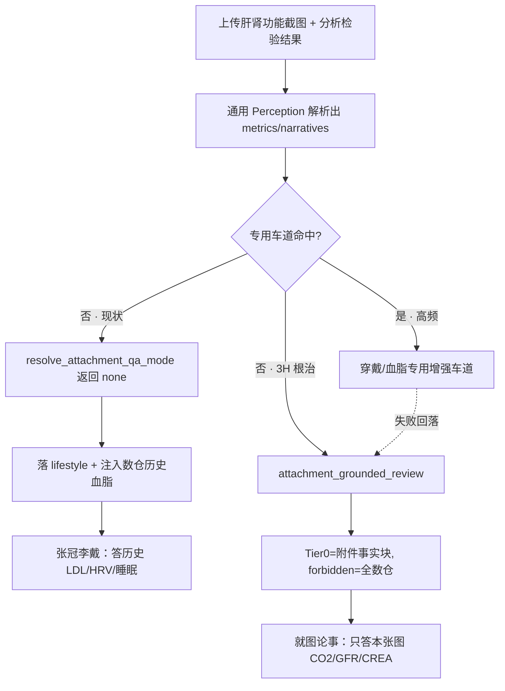

# RFC · Stage 3H — 通用附件兜底车道（Universal Attachment Lane）

> **文件名**：`docs/rfcs/rfc-stage3h-universal-attachment-lane.md`
> **版本**：v0.3（2026-06-27）
> **状态**：✅ **Closed（3H-α/β/γ/δ/ε 全量编码 · 148/148 压测验收）**
> **实施记录**：见 [`../harness-change-log.md`](../harness-change-log.md) 2026-06-26～27；自检 `scripts/pha_universal_attachment_lane_selfcheck.py`（15/15）；压测 `scripts/pha_universal_attachment_stress_battery.py`（148/148 seed=20260626）；错题本 [`anti-regression-constraints.md`](anti-regression-constraints.md)
> **定位**：补齐「任意健康截图 → 解析 → 展示 → 就图论事」最后一公里的 **通用泛化兜底层**，根治「按类穷举硬接」恶性循环。**非**为单条剧本打补丁。
> **上游（只读）**：[`harness-consensus-opus48-2026-06-08.md`](../harness-consensus-opus48-2026-06-08.md) · [`pha-pm-constitution.md`](../pha-pm-constitution.md)（§1–4） · [`stage3f-intent-resolution-completeness-rfc.md`](../stage3f-intent-resolution-completeness-rfc.md) · [`pha-architecture-evolution-v2.3.md`](../pha-architecture-evolution-v2.3.md)（§8）
> **下游编码（设计锁定，本 RFC 不实现）**：`attachment_asset_qa` · `chat_turn_routing` · `harness_plan` · `harness_tier0_assembly` · `session_turn_focus` · `perception_family` · `health_intent_catalog.json`

---

## 0. 执行口令与共识绑定

任何在本 RFC 下编码的 agent，开工前须：

1. 阅读本文档全文 + [`harness-consensus-opus48-2026-06-08.md`](../harness-consensus-opus48-2026-06-08.md) §2 硬约束；
2. 阅读 [`pha-pm-constitution.md`](../pha-pm-constitution.md) 第一～四条；
3. 首条实施回复包含：`CONSENSUS_ACK: rfc-stage3h-universal-attachment-lane read`。

**禁止**：

- 为通过「某一种新截图」在 Python 路由内新增 `document_family` if-else 或 phrase 白名单；
- 让 LLM / Shadow 直接选定 `TurnEvidencePlan` 或绕过 C 层数值审计；
- 以「提高 Tier0 上限」或「堆大上下文」替代车道补齐；
- 在通用车道内拉取与本轮附件无关的数仓历史（数仓物理隔离，见 §5）。

**Telemetry 驱动声明（宪法第二条）**：立项第一推动力为真机翻车现场——

> 用户上传**肝肾功能 + 电解质检验报告**截图并问「分析检验结果」，系统回复了**数仓历史血脂（2023/2025 LDL/HDL/TC/TG）+ HRV/睡眠/补剂建议**，与附件内容完全无关（「张冠李戴，幻觉答题」）。

根因不是某指标 SQL 读不到，而是 **路由完整性缺口**：泛化解析层挖出的结构化事实，被硬编码的最后一公里当垃圾丢弃。

---

## 1. 问题陈述（架构完整性）

### 1.1 上游已通用、下游强行归类

| 层 | 能力 | 现状 |
|----|------|------|
| **Perception 解析** | OCR + Vision 抽取 `results[]`（数字）/ `narratives[]`（文字） | ✅ **已族无关通用**（`VISION_EXTRACTION_SYSTEM_PROMPT`） |
| **document_family 分类** | supplement / lab / wearable / medication / **unknown** | ✅ 已含兜底类 |
| **Harness 分析车道** | profile 选择 + Tier0 注入 | ❌ **仅 supplement / wearable 有专用车道** |
| **解析结果展示** | 用户可见反馈 | ❌ 仅 supplement / wearable 完整 |

### 1.2 最后一公里的三处崩塌点

```text
任意截图（非穿戴/非补剂）
  → resolve_attachment_qa_mode：fam ∈ {lab, medication} → 直接返回 "none"   ← 崩塌点 A（踢出附件问答）
  → build_turn_evidence_plan：落 profile=lifestyle（最轻车道）
  → Tier0 = TASK only，无 ATTACHMENT_LABEL                                  ← 崩塌点 B（解析结果进不了上下文）
  → focus_summary_from_parsed：只读 label_ledger/vision_summary/narratives，
     忽略 metrics[]                                                          ← 崩塁点 C（化验数字被丢弃）
  → lifestyle 注入 PATIENT_STATE_LAB（数仓历史血脂）
  → LLM 按三步看诊模板「填空」→ 用数仓历史顶替本轮附件
```

> 三处崩塌点对应的现网代码位置见 §5（防御性降级落点）。

### 1.3 为什么「按类穷举」必然失败

用户输入空间是 **无穷** 的（心电图、处方、血压计、动态血糖 CGM、营养成分表、各类 App 截图……）。而系统已内置一个泛化引擎（LLM + Vision）。**正确解法是让长尾走泛化兜底，只把确定性车道留给少数高频头部**——这与宪法第四条「感知基础层泛化铁律」、共识 §3「路由在长尾表达上存在脆性」完全一致。

---

## 2. 业界先进范式对照表（State-of-the-Art Benchmarking）

> 宪法第一条：新阶段 Spec 强制 SOTA 对照。

| 业界范式 | 机制 | PHA 本地化吸收 | 拒绝照搬的部分 |
|----------|------|----------------|----------------|
| **OpenAI o-series 原生 Tool Use 路由** | 默认通用推理 + 工具仅在高置信时介入 | 通用兜底车道为默认；专用车道为「高置信工具」式可选增强 | 不把方向盘交给 LLM（健康域不可验证，共识 §5） |
| **Anthropic Claude「grounding / cite your sources」** | 回答必须锚定上下文证据，禁止外推 | 通用车道 TASK 硬绑「只就本轮 `results[]`/`narratives[]` 作答」 | 不依赖云端无限上下文堆料 |
| **Vercel AI SDK 上下文剪裁 / 渐进增强** | 默认精简 + 按需加载 | 通用车道物理隔离数仓，只注入本轮附件事实块 | 不为单 Fixture 抬车道权重 |
| **RAG「retrieval scope 隔离」** | 检索域与回答域强一致 | 附件轮的 retrieval scope = 本轮解析事实，禁串数仓历史 | 不混入跨域历史制造幻觉 |

**法理结论**：两层模型（通用兜底默认 + 专用增强可选）= o-series「默认通用、工具高置信介入」+ Claude grounding + 渐进增强的本地确定性融合。**非闭门造轮**。

---

## 3. 两层车道宪法（1 永久受益 + N 渐进增强）

```text
                    【 任意健康截图上传 】
                             │
                             ▼
              [ 通用 Perception 解析层 (OCR+Vision) ]
               → results[] + narratives[]（族无关）
                             │
                ┌────────────┴─────────────┐
        命中专用类型?(声明式)               否（长尾/未知）
                ▼                            ▼
   【第 2 层 · 专用增强车道】        【第 1 层 · 通用兜底车道】
   wearable_screenshot_review        attachment_grounded_review
   lab_cross_year（显式跨年）         · TASK 锚定：就图论事 Grounded
   · 90 天 CompareTable              · 物理隔离数仓历史
   · 跨年趋势数仓联动                 · 解析事实原样展示
   · 仅高频高价值才投资               · 建一次，永久兜住 ~90% 长尾
                │                            ▲
                └──────── fallback ──────────┘
              （专用车道未命中/失败 → 安全回落通用层，
                **绝不**回落 lifestyle 数仓）
```

**核心原则**：

| 原则 | 表述 |
|------|------|
| **通用优先** | 任意 `actionable` 附件 + 无专用车道命中 → **必落** `attachment_grounded_review`，**严禁** 落 `lifestyle` |
| **专用可选** | 专用车道是通用层之上的增强；未命中或失败时 **降级到通用层**，而非数仓乱答 |
| **声明式扩类** | 新增类型只加 `*.schema.json` + registry hints，**严禁** 改 Python 路由 |
| **数仓隔离** | 通用车道 `forbidden` 显式封禁所有数仓/历史槽位（§4.3） |

---

## 4. 通用车道契约：`attachment_grounded_review`

### 4.1 触发条件（声明式，非 phrase）

```text
进入 attachment_grounded_review 当且仅当：
  has_parse == True                                  # 本轮存在可用解析（attachment_parse_is_actionable）
  AND wearable_screenshot_review == False            # 未命中穿戴专用车道
  AND NOT 用户显式跨年化验意图(lab_cross_year)        # 未命中血脂跨年专用车道（沿用既有判定）
  AND qa_mode NOT IN (initial, lipid_bridge, episodic_bridge)  # 未命中补剂资产专用车道
```

> 判定输入仅为 **结构信号**（`has_parse` / `document_family` / 既有专用车道布尔），不引入任何「检验/肝功能/心电图」等业务词 if-else。`document_family ∈ {lab, medication, unknown, other}` 均同等滑入本车道。

### 4.2 输入契约（Tier0 槽位）

| 槽位 | 内容 | 来源 |
|------|------|------|
| `MASTER_ANCHOR` | 系统时间/身份锚 | 既有 |
| `ATTACHMENT_LABEL` | **本轮附件解析事实块**（见 §4.4 升级） | `focus_summary_from_parsed`（升级后含 `metrics[]`） |
| `DATA_AVAILABILITY` | 库内概况（只读，**不得**用作回答数字源） | 既有 `build_data_availability_block` |
| `TASK` | 就图论事防御性指令（见 §4.5） | 本 RFC 新增 |

`harness_tier0_assembly._PROFILE_CONFIG` 新增键：

```python
"attachment_grounded_review": {
    "priority": ["ATTACHMENT_LABEL", "DATA_AVAILABILITY", "TASK"],
    "protected": {"ATTACHMENT_LABEL", "TASK"},   # 事实块与任务永不被尾截断挤掉（共识 §2.2）
    "degradation_order": ["DATA_AVAILABILITY"],
    "supplement_start": "full",
}
```

### 4.3 禁用契约（数仓物理隔离 · forbidden）

```python
forbidden = [
    "GET_HEALTH_DATA", "GET_TEMPORAL_HISTORY_DOSSIER",
    "LDL_AUTHORITY", "PATIENT_STATE_LAB", "PATIENT_STATE_WEARABLE",
    "WEARABLE_90D_SUMMARY", "WEARABLE_COMPARE_TABLE",
    "DOSSIER_LAB", "DOSSIER_CLINICAL_COMPACT",
    "NUMERICS_MANIFEST",          # 数仓 Manifest 禁入；本轮事实仅来自附件
    "USER_SNAPSHOT", "fetch_evidence_by_id",
]
tools_allowed = []   # 通用兜底轮不发起数仓工具调用
```

> 这是对崩塌点的物理封印：即使模型想拉数仓历史血脂/HRV，槽位与工具白名单层面已不存在。

### 4.4 `metrics[]` 事实块升级（修复崩塌点 C）

`session_turn_focus.focus_summary_from_parsed` 行为升级（设计）：

```text
现状：return label_ledger || vision_summary || json(narratives) || ""   # 忽略 metrics[]
升级：当 metrics[] 非空且无 label_ledger 时，
      序列化为确定性事实表（不可变账本，宪法第三条）：
      【附件解析事实 · 本轮唯一数字源】
      | 项目 | 结果 | 单位 | 参考区间 | 异常 |
      | CO2  | 27   | mmol/L | 22.0-29.0 | — |
      | GFR  | 92.26| mL/(min*1.73m2) | — | — |
      ...（截断保护沿用 _compress_attachment_label）
```

要点：

- 事实表为 **不可变账本**，数字 100% 来自附件解析，模型无权改写（宪法第三条）；
- 与既有 `ATTACHMENT_LABEL` 槽位复用，不新建并行槽位（最小侵入）；
- C 层数值审计沿用：附件事实块即本轮 Manifest 等价物，回答数字须可追溯至该块。

### 4.5 防御性 TASK Prompt 规范（就图论事）

```text
【本轮任务 · 附件就图论事（Grounded）】
用户上传了一份健康相关截图，已解析为「附件解析事实」块（见 Tier0）。请用中文自然作答。

必须：
1) 先 1–2 句复述这是什么（依据解析事实/标题，勿臆断报告类型）。
2) 仅依据「附件解析事实」块中的 results/narratives 行作答：逐项给出数值、单位、参考区间，
   并指出明显偏离参考区间的项；每条数字须能对应事实块某一行。
3) 若用户问到事实块中不存在的指标：明说「本张截图未见该项」，禁止编造。

严禁：
- 引用或推断任何 **数仓历史数据**（历史血脂/HRV/睡眠/步数/补剂时间表）——本轮上下文已物理移除这些块。
- 使用「纵向趋势对账 / 多指标横向联动 / 硬核非药物干预」三步看诊模板标题。
- 把本张截图的指标归因到无关历史，或反向把历史数字套到本张图。
- 编造未在事实块中出现的数值、诊断或参考区间。

全文约 450 字以内。如需历史趋势对比，提示用户「先归档此报告后再问跨期趋势」。
```

> 与 `wearable_screenshot_review` / `attachment_asset_qa` 的 SOUL 收束一致：禁三步模板、禁数仓串扰、就事论事。

### 4.6 输出与展示契约（修复崩塌点的「可见反馈」）

| 阶段 | 行为 |
|------|------|
| SSE status | 解析完成推 `📎 已解析：N 项指标 / M 段叙述` |
| 用户消息预览 | 沿用 `【附件定账摘要 · 供核对】`，`metrics[]` 非空时改为事实表预览 |
| `done.ingest_payload` | 沿用既有「保存到健康档案」按钮 → `/api/chat/messages/{id}/ingest`（**入库通道零新增**，复用 §既有 `ingest_chat_message`） |

> 入库链路（聊天附件 → `ingest_chat_message` → `ingest_parsed_payload` → SQLite）与数据导入抽屉同源，**本 RFC 不改入库**，仅补「展示 + 分析」。

---

## 5. 防御性降级落点（设计锁定）

> 指令第 2 条：明确修改 `resolve_attachment_qa_mode` 与 `focus_summary_from_parsed`，**严禁** 把 lab/unknown 踢出或滑入 lifestyle。

| 落点 | 现状 | 升级（设计） | 崩塌点 |
|------|------|--------------|--------|
| `attachment_asset_qa.resolve_attachment_qa_mode` | `fam ∈ {wearable, lab, medication} → "none"` | 不再把 lab/medication 一脚踢出；新增返回 `"grounded"` 档（仅当无专用车道命中且 `has_parse`）。`wearable` 仍 `none`（走穿戴专用车道） | A |
| `chat_turn_routing.resolve_turn_routing` | qa_mode=none + 非穿戴 → 无车道 | qa_mode=`grounded` → `attachment_grounded_review`；专用车道未命中且 `has_parse` 的 lab/unknown 一律安全路由至此 | A/B |
| `harness_plan.build_turn_evidence_plan` | lab/unknown → lifestyle | 新增 `attachment_grounded_review` plan 分支（§4.2–4.3），优先级高于 lifestyle fallback | B |
| `session_turn_focus.focus_summary_from_parsed` | 忽略 `metrics[]` | `metrics[]` 非空 → 序列化确定性事实表（§4.4） | C |
| `harness_tier0_assembly._PROFILE_CONFIG` | 无该 profile | 新增 `attachment_grounded_review` 装配配置（§4.2） | B |
| `harness_profile_registry._KNOWN_ASSEMBLY_PROFILES` | 无 | 加入 `attachment_grounded_review` + slot invariants（`required_tier0={ATTACHMENT_LABEL, TASK}`） | — |

**关键不变量**：`lifestyle` 仍是「**无附件**的纯文本兜底」；**一旦本轮存在 actionable 附件，永远不得落 lifestyle**。

---

## 6. 声明式扩展标准（新类型接入 SOP）

> 目标：未来新增「心电图 / 处方 / 血压计 / CGM …」**零 Python 路由改动**。

| 想要的效果 | 接入方式 | 改动文件 |
|------------|----------|----------|
| 新类型被正确解析 + 通用兜底就图论事 | **零接入**（通用车道默认兜底） | 无 |
| 新类型在 `document_family` 被识别出独立标签 | 加 OCR 评分 marker（声明式数据） | `perception_media` 评分表（数据，非业务 if-else 路由） |
| 新类型获得**专用增强**车道 | 新增 `storage/schemas/<type>.schema.json`（`display` + `trigger_keywords` + `catalog.profiles`）+ registry `intent_hints` | `*.schema.json` / registry JSON |
| **严禁** | 在 `harness_plan` / `chat_turn_routing` 写 `if family == "xxx"` | — |

**准入门槛（专用车道）**：沿用 v2.3 §8 开放问题 4 的 Registry 准入——L2 数仓就绪 + Manifest domain + intent 块 + golden 句各 ≥3 条。**未达标者一律停留通用兜底层**。

---

## 7. 约束对齐（不破线核对）

| 硬约束（共识 §2 / 宪法） | 本 RFC 对齐 |
|--------------------------|-------------|
| TurnEvidencePlan 先于 LLM | `attachment_grounded_review` 是确定性 plan，先定 profile/slot/forbidden/tools |
| Tier0 预算保护 | `ATTACHMENT_LABEL` + `TASK` 列入 `protected`，不被尾截断 |
| C 层数值审计可追溯 | 附件事实块为本轮唯一数字源，回答数字须对应事实行 |
| Harness Veto | `tools_allowed=[]` + forbidden 封禁 fetch；LLM 无法越权拉数仓 |
| Shadow zero-adopt | 不引入任何 adopt 路径；Shadow 仍仅 telemetry |
| 不把方向盘交给 LLM | 路由由 L2 结构信号决定，非 LLM 自选 profile |
| 无 Python phrase 路由 | 触发仅靠 `has_parse` + 既有专用车道布尔；扩类走 schema/registry |
| Reflection 仅 R0/R1 | 本 RFC 不新增 LLM 自由反思；R0/R1 audit 不变 |
| 宪法第四条泛化铁律 | 通用兜底正是「从底层把路修平」，与业务族无关 |

---

## 8. 分期与 Flag

| 分期 | 内容 | Flag | 回滚 |
|------|------|------|------|
| **3H-α（P1 根治）** | `attachment_grounded_review` 通用车道：路由落点 A/B + plan + Tier0 装配 + forbidden 数仓隔离 + TASK | `PHA_UNIVERSAL_ATTACHMENT_LANE=1` | unset flag → 回退原 `resolve_attachment_qa_mode` 行为 |
| **3H-β（P1 事实块）** | `focus_summary_from_parsed` 序列化 `metrics[]` 事实表 + 展示预览 | 同上 flag 内 | 同上 |
| **3H-γ（P2 增强可选）** | 现有 wearable/supplement 车道显式声明「失败回落通用层」；声明式扩类 SOP 文档化 | 复用既有 flag | 配置回退 |

> **3H-γ 实施（2026-06-26）**：`attachment_grounded_fallback.py` 在专用车道（`wearable_screenshot_review` / `attachment_asset_qa` / `attachment_episodic_bridge`）结构化数据不足但 `metrics[]`/`narratives[]` 仍有时，于 slot 装配阶段安全 rebind 至 `attachment_grounded_review`（`harness_profile_registry._PROFILE_GROUNDED_FALLBACK` 显式声明）。**绝不**回落 lifestyle。

### 6.1 声明式扩类 SOP（运维手册）

| 目标 | 操作 | 改动文件 | 禁止 |
|------|------|----------|------|
| 新截图类型「能解析 + 就图论事」 | **零接入**（通用兜底默认生效） | 无 | — |
| 新 `document_family` 标签 | 加 OCR 评分 marker（声明式数据） | perception 评分表 / schema hints | Python `if family ==` |
| 高频类型要专用增强（跨年趋势等） | 新增 `storage/schemas/<type>.schema.json` + registry `intent_hints` | `*.schema.json` / registry JSON | 改 `harness_plan` / `chat_turn_routing` |
| 专用车道上线 | Registry 准入：L2 数仓 + Manifest domain + golden ≥3 句 | schema + registry + golden | 未达标者停留通用兜底层 |

**专用车道失败**：自动回落 `attachment_grounded_review`（3H-γ），不回 lifestyle。

> 默认 `PHA_UNIVERSAL_ATTACHMENT_LANE` 在 env-8788 验证期开启；灰度通过后转默认常开。

---

## 9. 验收与回归（共识 §6 强制）

| 检查 | 期望 |
|------|------|
| 上传肝肾功能截图 + 「分析检验结果」 | 落 `attachment_grounded_review`；回答**仅含本张图指标**（CO2/GFR/CREA…），**不含**数仓历史血脂/HRV/睡眠 |
| harness report `profile` 字段 | `attachment_grounded_review`（非 `lifestyle`） |
| 通用车道 Tier0 | 含 `ATTACHMENT_LABEL`（带 metrics 事实表）+ `TASK`；**不含** 任何数仓槽位 |
| `focus_summary_from_parsed(metrics-only payload)` 自检 | 返回非空事实表 |
| 既有穿戴/补剂剧本回归 | 不退化（仍走各自专用车道） |
| `pha_harness_profile_registry_selfcheck` | `attachment_grounded_review` slot invariants 通过 |
| 新增自检 | `pha_universal_attachment_lane_selfcheck.py`：lab/medication/unknown 三 family 均路由通用车道 + forbidden 含全部数仓槽位 |

**回滚路径**：`unset PHA_UNIVERSAL_ATTACHMENT_LANE` → `resolve_attachment_qa_mode` / `build_turn_evidence_plan` 回退原行为（lab→none→lifestyle）；`focus_summary_from_parsed` 升级为**纯增量**（metrics 为空时行为不变），无需回滚。

**Telemetry 回归**：上线后监控 `profile=attachment_grounded_review` 占比 + 该 profile 下 `numerics_audit` 失败率（应 ≈ 0，因数字源单一）。

---

## 10. 非目标

- ❌ 不在本 RFC 实现代码（设计锁定，编码为 3H-α/β/γ 单独 PR）。
- ❌ 不改入库链路（`ingest_chat_message` 复用，零新增）。
- ❌ 不为「检验报告」单独造闭环——本 RFC 即「不再为任何单类型造闭环」的根治方案。
- ❌ 不新增 LLM 自由反思 / Shadow adopt。
- ❌ 不动数据导入抽屉的 pageLedger（前端展示复用为 3H-γ 可选项）。

---

## 附录 A · 因果链（翻车 → 根治）


