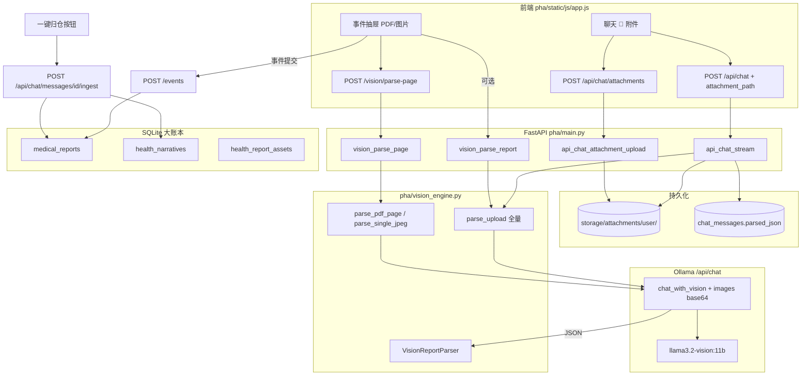

# PHA 多模态上传与 Vision 解析 — 完整代码流向

> 覆盖三条入口：**事件抽屉分片解析**、**全量 `/vision/parse`**、**聊天附件 v1.8.5**

---

## 1. 总览图



---

## 2. 路径 A — 事件抽屉（生产主路径，分片）

### 2.1 前端

| 步骤 | 位置 | 行为 |
|------|------|------|
| 选文件 | `#pdf-file` / 拖拽区 | `pdfFiles[]` 队列 |
| 分片请求 | `parseVisionPage(fd)` | `POST /vision/parse-page` multipart |
| 双轨清洗 | `splitTracksFromPageData(pageData)` | 数字 → `metrics`，文本 → `narratives` |
| 页级账本 | `pageLedger[]` | 每页 status / metrics / narratives |
| 入库 | `POST /events` | `persist_metrics` + `persist_narratives` |

**关键函数**（`app.js`）：

```javascript
splitTracksFromPageData(pageData)  // ~L960
// metrics_preview 或 extraction.results → metrics[]
// 非数字行 → narratives[]

fetch('/vision/parse-page', { method: 'POST', body: FormData })
```

### 2.2 后端

```
POST /vision/parse-page
  main.vision_parse_page(file, page_index, page_total?)
    → VisionReportParser().parse_pdf_page(raw, page_index, page_total)
         ├─ pdf_hybrid_parser.get_pdf_parse_mode()
         ├─ [native] parse_pdf_page_native → extract_pdf_page_text → native_page_to_extraction
         └─ [scan]  parse_pdf_page_vision → render_pdf_page_jpeg → parse_single_jpeg
              → OllamaProvider.chat_with_vision(system, user, images=[b64])
              → _extract_json_object → ReportExtraction
    → build_vision_page_response() → VisionPageParseResponse
```

**响应字段**（前端消费）：

- `extraction.results[]` — `item, value, unit, ref, is_abnormal`
- `extraction.narratives[]` — `category, content, summary`
- `metrics_preview[]` — 已规范化预览
- `parse_mode` — `native` | `scan`
- `parse_channel` — `heuristic` | `text_llm` | `vision`

---

## 3. 路径 B — 全量解析（单请求多页）

```
POST /vision/parse  (multipart file)
  main._vision_parse_impl(raw, filename)
    → VisionReportParser.parse_upload(raw, filename)
         ├─ image_file_to_png_list() 或 PDF 逐页渲染
         ├─ 循环: chat_with_vision 每页
         └─ merge ReportExtraction → VisionParseResponse
              ├─ extraction
              ├─ metrics_preview
              ├─ summary_text
              └─ abnormal_count
```

`POST /vision/parse-stream`：同上，NDJSON 进度回调 `on_progress`。

---

## 4. 路径 C — 聊天附件（v1.8.5 物理落袋）

### 4.1 两阶段 HTTP

```
[阶段 1] 落盘（严禁看完即焚）
  用户选 📎 → pendingChatAttachment
  sendAsk() → uploadChatAttachment(file)
    POST /api/chat/attachments  (FormData: user_id, file)
      attachment_storage.save_chat_attachment()
        → personal_health_agent/storage/attachments/{user_id}/{stem}_{uuid}.ext
    返回 { attachment_path, attachment_name, stored_filename }

[阶段 2] 对话 + Vision + 持久化元数据
  POST /api/chat  JSON {
    message, model, session_id,
    attachment_path, attachment_name
  }
    stream_pha_chat_events()
      append_message(user, ..., attachment_path, attachment_name)
      _vision_parse_attachment(path) → VisionReportParser.parse_upload
      update_message_parsed_json(user_message_id, JSON)
      ... LLM 流式回复 ...
      done { ingest_payload, user_message_id, assistant_message_id }
```

### 4.2 归仓（用户点击金色按钮）

```
前端 attachIngestButton()
  splitTracksFromPageData(ingest_payload)   // 复用事件抽屉同一套清洗
  POST /api/chat/messages/{user_message_id}/ingest
    chat_ingest.ingest_chat_message()
      rows_from_client_metrics / rows_from_client_narratives  (event_medical.py)
      delete_report_* + insert_medical_metrics + insert_health_narratives
      save_health_report_asset(source_kind='chat_ingest')
      update_message_ingested(ingested_at)
```

---

## 5. Vision 引擎内部（`vision_engine.py`）

| 类/函数 | 作用 |
|---------|------|
| `VisionReportParser` | 端到端解析器 |
| `_acquire_vision_llm()` | 解析 `llama3.2-vision:11b`（`vision_parser.resolve_vision_11b_model`） |
| `parse_single_jpeg()` | 单页图片 → Ollama vision → JSON |
| `parse_pdf_page_native()` | PDF 文本层 + gemma 清洗（`pdf_hybrid_parser`） |
| `parse_pdf_page_vision()` | 扫描件渲染 JPEG → vision |
| `parse_upload()` | 多页合并 + `metrics_preview` |
| `build_vision_page_response()` | 统一响应 DTO |

**Ollama Vision Payload**（`llm_provider.chat_with_vision`）：

```json
{
  "model": "llama3.2-vision:11b",
  "messages": [
    { "role": "system", "content": "<VISION_EXTRACTION_SYSTEM_PROMPT>" },
    { "role": "user", "content": "<页码提示 + VISION_PAGE_USER_PROMPT>", "images": ["<base64>"] }
  ],
  "stream": false,
  "keep_alive": 0
}
```

**JSON 提取**：`vision_parser._extract_json_object` → `ReportExtraction`（`date, hospital, results[], narratives[]`）

---

## 6. 数据落点对照

| 阶段 | 存储 | 生命周期 |
|------|------|----------|
| 原始文件（聊天） | `storage/attachments/` | 永久 |
| 解析 JSON（聊天） | `chat_messages.parsed_json` | 永久 |
| 结构化指标 | `medical_reports` | 归仓后永久 |
| 叙事文本 | `health_narratives` | 归仓后永久 |
| Vision 元数据 | `health_report_assets` | 归仓/事件提交时 |
| 事件时间线 | `store` 内存 `HealthEvent` | 进程内（重启丢失） |

---

## 7. 错误与降级

| 场景 | HTTP | 行为 |
|------|------|------|
| Vision 模型未安装 | 503 | `vision_not_ready` |
| JSON 解析失败 | 422 | `vision_json_parse` + `raw_snippet` |
| 单页超时 120s | 200 软失败 | `parse_ok=false`, `warning=...`（分片可继续） |
| 全量超时 | 504 | 提示缩小 PDF |
| 聊天附件 Vision 失败 | SSE status | 文件仍保留，继续文本对话 |

---

## 8. 相关源文件索引

```
pha/main.py              # HTTP 端点
pha/vision_engine.py     # 解析核心
pha/vision_parser.py       # JSON 提取 / 模型解析
pha/pdf_hybrid_parser.py   # native vs scan 分流
pha/attachment_storage.py  # 聊天附件落盘
pha/chat_service.py        # 聊天内嵌 Vision
pha/chat_ingest.py         # 归仓管道
pha/event_medical.py       # rows_from_client_* 转换
pha/static/js/app.js       # splitTracksFromPageData, sendAsk, ingestChatPayload
pha/index.html             # #chat-attach-file, .pha-ingest-gold-btn
```
